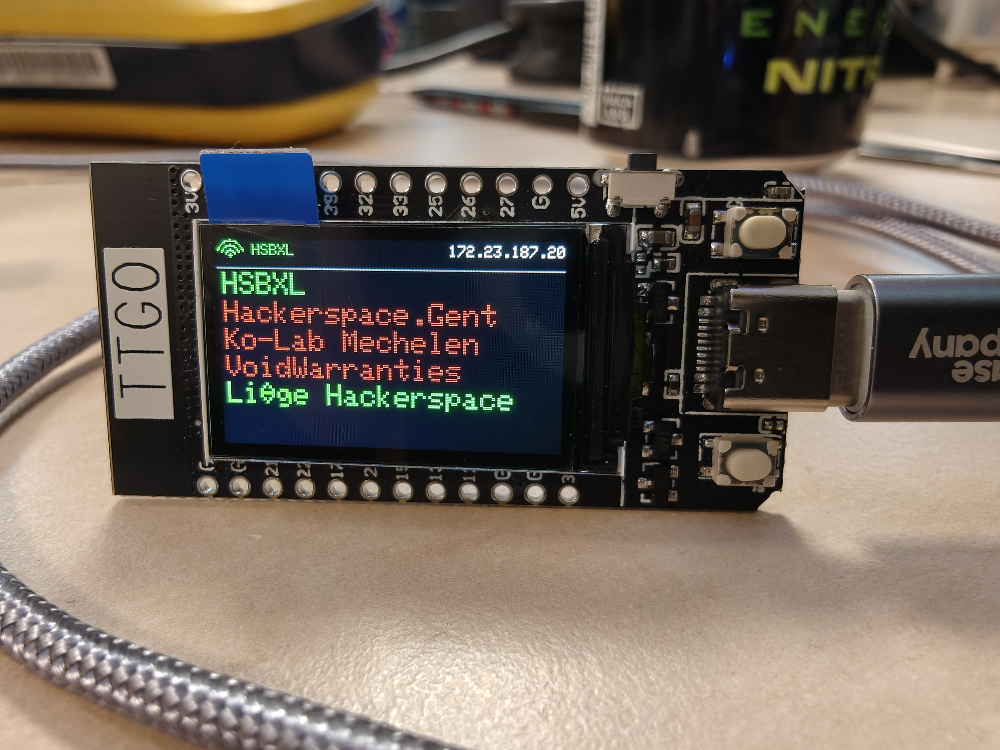

# TTGO T-Display SpaceAPI Client

A [SpaceAPI](https://spaceapi.io/) status display built on the TTGO T-Display ESP32. Shows the open/closed status of hackerspaces in real time.



## Features

- **WiFi provisioning** via captive portal (WiFiManager) — no hardcoded credentials
- **Configurable SpaceAPI endpoints** — add any number of SpaceAPI URLs through the web interface
- **Color-coded status** — green (open), red (closed), white (unknown)
- **Configurable hostname**
- **Persistent configuration** — settings survive reboots (stored on SPIFFS)
- **Auto-refresh** — status updates every 60 seconds
- **HTTPS support** with redirect following

## Hardware

- [TTGO T-Display ESP32](https://www.lilygo.cc/products/lilygo%C2%AE-ttgo-t-display-1-14-inch-lcd-esp32-control-board) (LilyGO)
- 1.14" IPS ST7789V display, 135x240px
- USB-C for power and programming

## Setup

### Prerequisites

- [PlatformIO](https://platformio.org/) (CLI or IDE plugin)

### Build & Upload

```bash
# Build
pio run

# Upload to board
pio run --target upload

# Serial monitor
pio device monitor

# Build + upload + monitor
pio run --target upload && pio device monitor
```

### First Boot

1. The device creates a WiFi access point called **TTGO-Setup**
2. Connect to it and a captive portal opens
3. Select your WiFi network and enter the password
4. Go to the **param** page to configure:
   - **Hostname** — device network name
   - **SpaceAPI** — one URL per line
5. Save — the device connects to WiFi and starts displaying space statuses

### Finding SpaceAPI URLs

Browse the [SpaceAPI directory](https://directory.spaceapi.io/) to find your local hackerspace's endpoint.

## License

MIT
